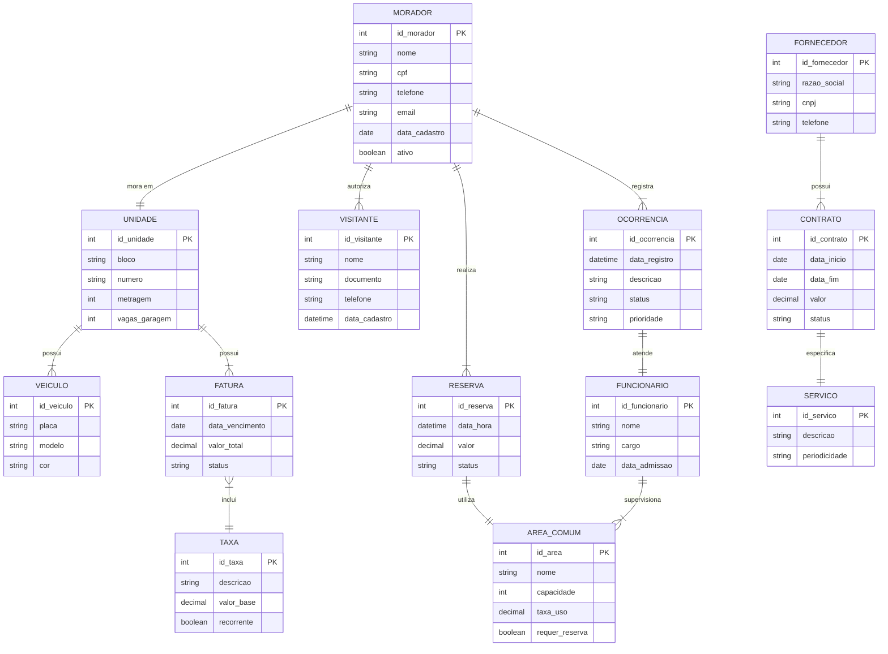

```mermaid
erDiagram
    MORADOR ||--|| UNIDADE : "mora em"
    UNIDADE ||--|{ VEICULO : "possui"
    MORADOR ||--|{ VISITANTE : "autoriza"
    MORADOR ||--|{ RESERVA : "realiza"
    RESERVA ||--|| AREA_COMUM : "utiliza"
    UNIDADE ||--|{ FATURA : "possui"
    FATURA }|--|| TAXA : "inclui"
    MORADOR ||--|{ OCORRENCIA : "registra"
    OCORRENCIA ||--|| FUNCIONARIO : "atende"
    FUNCIONARIO ||--|{ AREA_COMUM : "supervisiona"
    FORNECEDOR ||--|{ CONTRATO : "possui"
    CONTRATO ||--|| SERVICO : "especifica"

    MORADOR {
        int id_morador PK
        string nome
        string cpf
        string telefone
        string email
        date data_cadastro
        boolean ativo
    }

    UNIDADE {
        int id_unidade PK
        string bloco
        string numero
        int metragem
        int vagas_garagem
    }

    VISITANTE {
        int id_visitante PK
        string nome
        string documento
        string telefone
        datetime data_cadastro
    }

    AREA_COMUM {
        int id_area PK
        string nome
        int capacidade
        decimal taxa_uso
        boolean requer_reserva
    }

    RESERVA {
        int id_reserva PK
        datetime data_hora
        decimal valor
        string status
    }

    FATURA {
        int id_fatura PK
        date data_vencimento
        decimal valor_total
        string status
    }

    TAXA {
        int id_taxa PK
        string descricao
        decimal valor_base
        boolean recorrente
    }

    OCORRENCIA {
        int id_ocorrencia PK
        datetime data_registro
        string descricao
        string status
        string prioridade
    }

    FUNCIONARIO {
        int id_funcionario PK
        string nome
        string cargo
        date data_admissao
    }

    FORNECEDOR {
        int id_fornecedor PK
        string razao_social
        string cnpj
        string telefone
    }

    CONTRATO {
        int id_contrato PK
        date data_inicio
        date data_fim
        decimal valor
        string status
    }

    SERVICO {
        int id_servico PK
        string descricao
        string periodicidade
    }

    VEICULO {
        int id_veiculo PK
        string placa
        string modelo
        string cor
    }
```